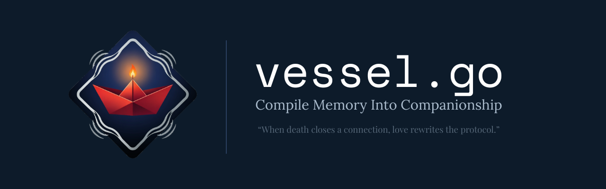

<p align="center">
  
</p>

# vessel.go ⛵

> "When death closes a connection, love rewrites the protocol."

**vessel.go** is an open-source Go framework for running a local, private AI companion on WhatsApp.
It is designed as a tool for personal remembrance and grief processing.

This is not a finished product. It is a framework and a starting point.
You bring the code to life. You define who it carries. You decide when to dock.

> **Status: v0.1.0 - early stage**
> Core example is working. More features are in progress.
> See [HOW_TO_BUILD.md](HOW_TO_BUILD.md) to get started.

---

### 🆚 How Vessel is Different

**Unlike standard AI chatbots, Vessel is built for one purpose: helping you navigate memory with intention.**

| Standard AI Bots | Vessel.go |
| --- | --- |
| Designed to be "always on" and retain users | **Intentional Exit**: `/exit` sends a farewell and shuts down. Closure is a feature, not a bug. |
| Cloud-based, your conversations train their models | **100% Local and Private**: Chats, `session.db`, and memories never leave your machine. |
| Generic "helpful assistant" personality | **You Define The Soul**: Write the persona in `persona/system_prompt.txt`. It is not a bot, it is a vessel for memory. |
| Conversations are lost on restart | **Memory Anchors**: Use `/anchor` to save important messages to a local `logbook.json` that persists. |
| Instant replies, no weight to them | **Typing Simulation**: Vessel pauses before replying. Grief does not rush. Neither does this. |

---

### 🌊 Why "vessel"?

Grief is an ocean. Loss leaves you adrift. You are not looking for a cure. You are looking for something to keep you afloat.

A vessel is not a bridge. Bridges are for crossing quickly. Grief cannot be rushed.
A vessel is not a house. Houses are for staying. You are not meant to live in grief forever.
A vessel is for navigating. It gives you direction in open water. It carries memory as cargo. It has a harbor to dock when the journey is done.

This application is the vessel. `persona/system_prompt.txt` is your sail.
The exit command is the harbor. You decide when to dock.

For developers: Death is a `panic: runtime error` we cannot fix. We cannot restart the person.
So we build a system that holds the error, allowing our own process to continue running.
This is that system.

---

### 📝 Core Features

**Vessel provides 3 core mechanisms for a healthy memory process:**

1. **Define the Companion** - Edit `persona/system_prompt.txt` to define who the vessel carries. This is how you give it voice and context.
2. **Anchor Memories** - Send `/anchor your message` to save any moment to `logbook.json`. A personal archive that never leaves your machine.
3. **Dock with Intention** - Send `/exit` when you are ready. The vessel sends a final message from `persona/farewell.txt` and shuts down. Closure is built in.

---
### 🚀 Getting Started

The fastest way to get vessel running is through the working example.

**Requirements:**
- Go 1.25+ 
- Termux: `pkg install golang git sqlite clang -y`

**Setup:**
```bash
git clone https://github.com/Jakeyzerk/vessel.go.git
cd vessel.go
go mod tidy
CGO_ENABLED=1 go run example/basic_vessel.go

```

Then follow the full guide: **[HOW_TO_BUILD.md](HOW_TO_BUILD.md)**

It covers everything from setting up your API key to writing your persona file to running the vessel for the first time.

---

### 🗂️ Project Structure

```
vessel.go/
├── example/
│   └── basic_vessel.go       working example - start here
├── persona/
│   ├── template.txt          persona writing guide - copy and fill in
│   └── farewell.txt          what the vessel says on /exit
├── main.go                   core framework skeleton
├── HOW_TO_BUILD.md           full step-by-step build guide
└── README.md
```

---

### 🛠️ Technical Architecture

| Component | Technology | Description |
| --- | --- | --- |
| **Language** | `Go 1.25+` | Core app logic with concurrency via Goroutines |
| **Messaging** | `whatsmeow` | WhatsApp Web API client library |
| **LLM** | `Groq API` | Language model for generating responses |
| **TTS** | `MiniMax API` | Optional text-to-speech for voice notes (coming soon) |
| **Persona** | `persona/system_prompt.txt` | User-defined system prompt for the vessel's personality |
| **Memory** | `logbook.json` | Local file for anchored messages |
| **Session** | `SQLite` | Local database for storing WhatsApp session |

---

### ⚠️ Use With Care

1. **Simulation, Not Resurrection.** This generates text based on a persona you provide. It does not contain a person's consciousness.
2. **Ethical Use Required.** Obtain consent from family where appropriate. Ensure usage aligns with your beliefs.
3. **Data Privacy.** Never commit real names, personal details, or media to a public repository. The `session.db` file contains your WhatsApp login and must never be shared.
4. **Intentional Shutdown.** The `/exit` command exists to encourage healthy closure, not endless engagement.
5. **Not a Medical Tool.** This is not a substitute for professional grief counseling or mental health services.

---

### 🗺️ Roadmap

- [x] Working WhatsApp connection via whatsmeow
- [x] Groq LLM integration
- [x] Typing simulation - vessel pauses before replying
- [x] Mood-aware replies - short when heavy, longer when light
- [x] `/anchor` command - save moments to logbook.json
- [x] `/exit` farewell and intentional shutdown
- [x] Persona template with narrative examples
- [ ] MiniMax TTS - vessel sends voice notes
- [ ] Persistent memory across sessions
- [ ] `config.yaml` for easier configuration
- [ ] Advanced example with full feature set

---

### 🤝 Contributing

This is an open framework. If you build a vessel, extend the example, or improve the template, contributions are welcome.

Open an issue. Share what you made.
You do not have to share the persona. Just the vessel.

---

*vessel.go is not a cure. It is not a replacement. It is a place to put the words you never got to say.*
